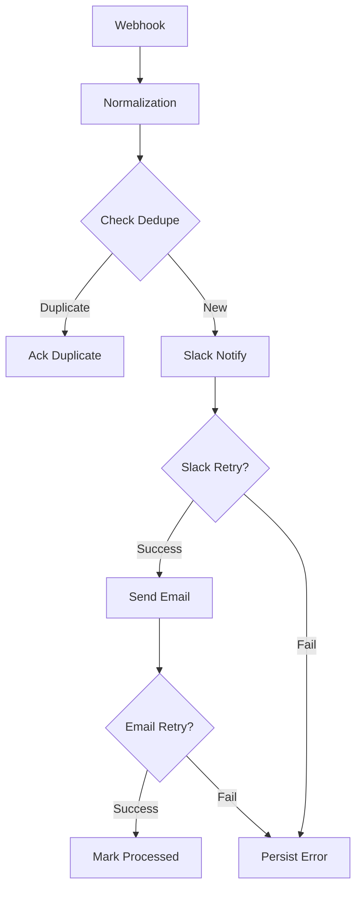

# Technical Documentation: Incident Notification Workflow

## 1. Workflow Architecture Overview

This "Production Grade" n8n workflow is designed to process incoming incident webhooks, normalize the data, prevent duplicate notifications, and ensure reliable delivery to Slack and Microsoft Outlook via custom retry loops and offline-safe failure logging.

### Logic Diagram


### Logical Flow
1. **Trigger**: Receives `POST` request at `/incident`.
2. **Normalize & Validate**: Enforces schema validation and converts severity labels to numeric levels.
3. **Check Deduplication**: Verify if the incident has already been processed using a local state file.
   - **Formula**: `{{incidentId}}:{{severity}}:{{createdAt}}`
4. **Slack Notification**: Attempt delivery to Slack.
5. **Duo-Retry Loops**: Custom logic for both Slack and O365 to handle throttling (429) or server errors (5xx) with backoff and a 5-attempt limit.
6. **Email Notification**: Delivery via Microsoft Graph API mock.
7. **Post-Success Marking**: Only registers the incident as "processed" once both notifications are successfully triggered.
8. **Failure Logging**: If retries fail at any stage, detailed incident data is persisted to a local JSON audit log.

---

## 2. Technical Node Details

### Validate & Normalize (Code Node)
- **Validation**: Throws errors for missing `incidentId`, `severity`, `title`, or `createdAt`.
- **Mapping**: Converts `P1`-`P4` strings into numeric `1`-`4` levels.
- **Truncation**: Truncates descriptions to 240 characters for Slack payload limits.

### Check Deduplication (Execute Command)
- **Strategy**: Uses a flat-file check (`processed_ids.log`) instead of internal memory.
- **Why**: This ensures idempotency works even when manually clicking "Execute Workflow" or restarting the n8n service.

### Manual Retry Loop (IF + Wait)
- **Circuit Breaker**: Uses a manual counter (`retryCount`) to prevent infinite loops.
- **Selective Retry**: Only retries on 429 and 5xx status codes; ignore 400/401/404 errors as they require manual intervention.

---

## 3. Test Cases (Verification Plan)

| Test Case ID | Scenario | Steps | Expected Result |
| :--- | :--- | :--- | :--- |
| **TC-01** | **Standard Success** | Send a valid P2 incident payload. | Workflow finishes green; Slack & Email mocks log successes. |
| **TC-02** | **Validation Error** | Send payload missing `severity` field. | Workflow fails at "Validate" node with `Missing required field` error. |
| **TC-03** | **Deduplication** | Send the exact same payload two times. | 1st run succeeds; 2nd run stops at "Not Duplicate?" and hits "Acknowledge Duplicate." |
| **TC-04** | **Retry Logic (429)** | Set `$env:SLACK_FAIL_429_N=2`. Run workflow. | Workflow loops through "Backoff Wait" node 2 times then succeeds. |
| **TC-05** | **Failure Logging** | Set `$env:SLACK_FAIL_500_N=10`. Run workflow. | Workflow retries 5 times, then takes the "False" path to "Persist Failure." |

---

## 4. Local Environment Setup

### Prerequisites
- Node.js v18+
- n8n (Local installation)
- PowerShell (For filesystem-based state checks)

### Mock Servers
1. Start the mock environment: `npm run mocks`
2. Failure injection (optional): `$env:SLACK_FAIL_429_N=2`

### Running the Workflow
1. Import `submission/workflow.json` into n8n.
2. Send test payload via `curl.exe`:
```powershell
curl.exe -X POST http://localhost:5678/webhook-test/incident -H \"Content-Type: application/json\" -d '{...}'
```

---

## 6. Sample Payload (Input Schema)

The workflow expects a JSON payload matching the following schema (as seen in `fixtures/incidents/`):

```json
{
  "incidentId": "INC-10001",
  "severity": "P2",
  "sourceSystem": "ServiceDesk",
  "title": "Search latency elevated",
  "description": "Search API p95 latency increased above 2s in multiple regions. Investigating upstream cache.",
  "createdAt": "2026-02-25T17:20:00Z",
  "storeId": "S-0192",
  "ownerEmail": "oncall@example.com",
  "metadata": {
    "correlationId": "corr-10001",
    "tags": ["search", "latency"]
  }
}
```

## 7. Expected Mock Responses

When notifications are successful, the mocks return the following:

| Service | HTTP Status | Response Body |
| :--- | :--- | :--- |
| **Slack Mock** | 200 OK | `{"ok": true, "channel": "#oncall-alerts", ...}` |
| **O365 Email Mock** | 202 Accepted | *(No body content)* |

---

## 8. Artifacts Produced
- **`submission/workflow.json`**: The final production-grade n8n export.
- **`submission/processed_ids.log`**: State file for deduplication.
- **`submission/failures.json`**: JSON audit log for incidents that failed delivery.
- **`submission/NOTES.md`**: Implementation summary.
